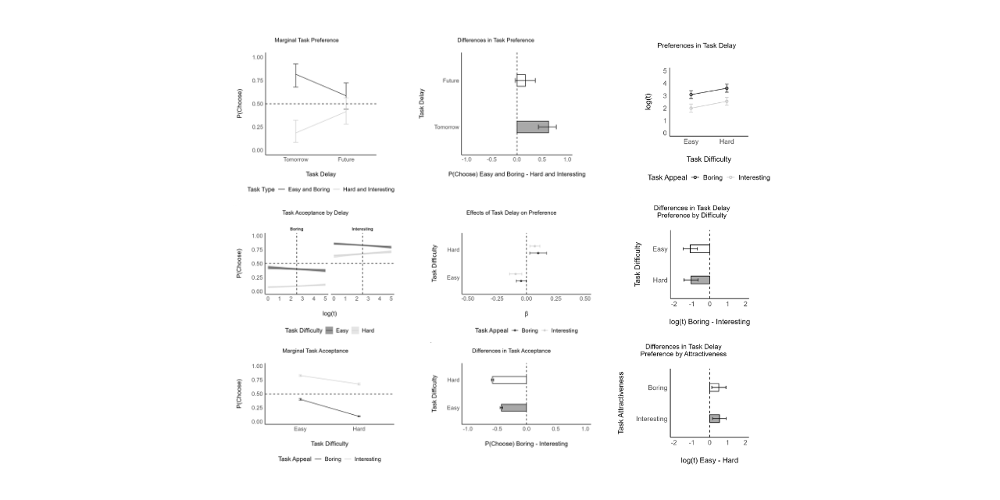

# Task timing and preference analysis

This repository contains the data preprocessing and analysis scripts for a research project investigating temporal task scheduling and preferences. The study examines how task timing, difficulty, and attractiveness influence decision-making across three experiments.

## Table of Contents

* [Overview](#overview)
* [Directory Structure](#directory-structure)
* [Installation](#installation)
* [Usage](#usage)
* [Data](#data)
* [Analysis](#analysis)
* [License](#license)
* [Citation](#citation)
* [Contact](#contact)

## Overview

This project investigates how individuals make decisions about task scheduling based on factors such as:

1. Task timing (immediate vs. future)
2. Task difficulty (easy vs. hard)
3. Task attractiveness (boring vs. interesting)

The research uses both empirical and modeling approaches to demonstrate how these factors interact to influence task preferences and scheduling decisions.

**Key components of the analysis include:**

- Power analysis for sample size estimation
- Data preprocessing for three experiments
- Statistical analysis using Bayesian models
- Visualization of results

## Directory Structure

```
temporal-task-scheduling/
│
├── data/
│   ├── raw/
│   └── prepared/
│
├── output/
│   ├── figures/
│   └── results/
│
├── prepare_data.R
├── analysis_exp1.R
├── analysis_exp2.R
├── analysis_exp3.R
├── power.R
├── LICENSE
└── README.md
```

## Installation

To run the analysis, you'll need R and the following packages installed:

```r
install.packages(c("tidyverse", "brms", "easystats", "patchwork", "glmmTMB", "simr"))
```

## Usage

1. Download or clone this repository:

```
git clone https://github.com/yourusername/temporal-task-scheduling.git
```

2. Navigate to the project directory:

```
cd temporal-task-scheduling
```

Run the R scripts in the following order:

- `power.R`
- `prepare_data.R`
- `analysis_exp1.R`
- `analysis_exp2.R`
- `analysis_exp3.R`

Each script can be executed in an R environment. The scripts are designed to be run sequentially, as later scripts may depend on the output of earlier ones.

### Data

The project includes data from three experiments:

- Experiment 1: Choice between easy/boring and hard/interesting tasks with immediate or future timing
- Experiment 2: Preferences for task delay based on difficulty and attractiveness
- Experiment 3: Task acceptance probabilities based on difficulty, attractiveness, and delay

Raw data is stored in `data/raw/`, and preprocessed data is saved in `data/prepared/`.

### Analysis

The analysis is split into several steps:

- Power analysis for sample size estimation (`power.R`)
- Data preprocessing (`prepare_data.R`)
- Analysis of Experiment 1 (`analysis_exp1.R`)
- Analysis of Experiment 2 (`analysis_exp2.R`)
- Analysis of Experiment 3 (`analysis_exp3.R`)

Results, including figures and statistical outputs, will be saved in the `output/` directory.

## License

This project is licensed under the MIT License - see the LICENSE file for details.

## Citation

If you use this code or data in your research, please cite our paper:

[Citation information to be added upon publication]

## Contact

For any questions or feedback, please contact the author directly.
