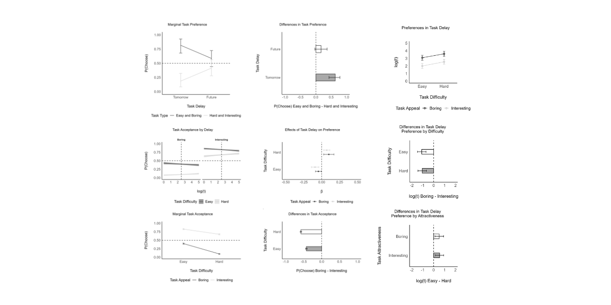

# Task timing and preference

[](LICENSE)

This repository contains the prepared data, R code, Bayesian analysis notebooks, and figure outputs for four studies of task timing and preference. The pilot calibrates task ratings; the three experiments examine how timing, difficulty, and attractiveness relate to task choice or preferred delay.

The Quarto website is a locked study companion. Its public pages present aggregate summaries and model results while retaining the executable specifications used for each analysis.

## Studies

| Study | Outcome | Analysis |
|---|---|---|
| Pilot | Difficulty and interest ratings | Paired Bayesian *t*-tests |
| Experiment 1 | Choice between task types | Aggregated binomial-logit model |
| Experiment 2 | Preferred task delay | Gaussian mixed model |
| Experiment 3 | Task acceptance | Bernoulli-logit mixed model |

The four reports are in [`analysis/`](analysis/). Start with the [pilot](analysis/analysis_pilot.qmd), [Experiment 1](analysis/analysis_exp1.qmd), [Experiment 2](analysis/analysis_exp2.qmd), or [Experiment 3](analysis/analysis_exp3.qmd).

## Repository layout

| Path | Contents |
|---|---|
| `analysis/` | Canonical Quarto analysis notebooks and notebook metadata |
| `data/prepared/` | Versioned analysis-ready data |
| `R/` | Data preparation and power analysis |
| `output/` | Published figures and ignored local model caches |
| `_freeze/` | Versioned Quarto execution snapshots used by the static build |
| `_site/` | Ignored local website output selected for static publishing |
| `work/` | Ignored publication materials, excluded from the website |

Raw source data are intentionally excluded from version control. Prepared data remain versioned for reproducibility and may contain pseudonymous participant identifiers. The rendered website does not display participant-level rows.

## Reproduce

Use R 4.5 or later and Quarto 1.9 or later. The notebooks and site build use `tidyverse`, `brms`, `easystats`, `emmeans`, `gt`, `patchwork`, `see`, `BayesFactor`, `bayestestR`, and `quarto`; the power analysis additionally uses `pwr`, `glmmTMB`, and `simr`.

1. Clone the repository and open its root directory.
2. Render the verified static site from the committed freezer:

   ```powershell
   quarto render
   ```

3. Open `_site/index.html` and inspect the full site locally.
4. Publish `_site/` as a static site, using `_site/index.html` as the entry point.

To intentionally refresh a frozen execution, render each notebook with `quarto render analysis/<notebook>.qmd --execute`, then run `quarto render --use-freezer` for the complete site. A refresh requires the prepared data, the complete R package environment, and Stan toolchain. It should be followed by checks that the prepared inputs, inferential specifications, numerical outputs, and exported figures remain unchanged.

## License

The code and site source are licensed under the [GNU General Public License v3.0](LICENSE).
