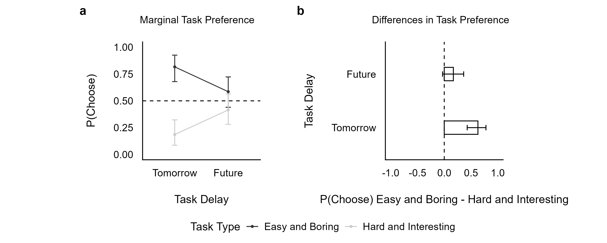
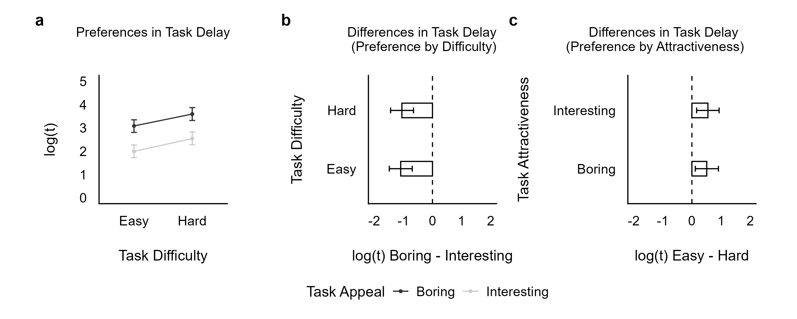
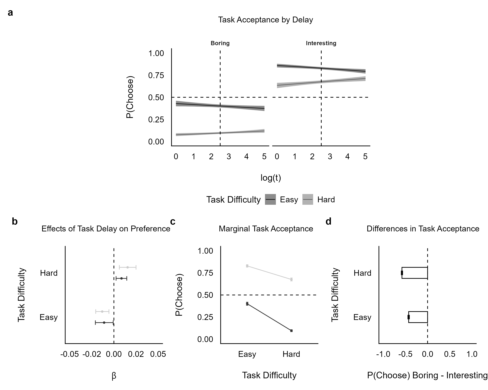

## Overview

This website accompanies a research paper investigating how individuals make decisions about task scheduling. The study examines how three key factors --- task timing, difficulty, and attractiveness --- interact to influence when people choose to perform tasks.

Across three experiments, we demonstrate that people systematically adjust their scheduling preferences based on the interplay between what a task demands (easy vs. hard), how appealing it is (boring vs. interesting), and when it must be completed (now vs. later). All analyses use Bayesian statistical models to quantify these effects and their uncertainty.

## Experiments

| Experiment | Design | Model | Research Question | Report |
|:-----------|:-------|:------|:------------------|:-------|
| Pilot | Within-subjects | Bayesian paired *t*-test | Do task difficulty and interest ratings differ between experimental and survey contexts? | [View](analysis/analysis_pilot.qmd) |
| Experiment 1 | 2 x 2 (timing x task type) | Binomial (logit) | How does task timing affect preference between easy/boring and hard/interesting tasks? | [View](analysis/analysis_exp1.qmd) |
| Experiment 2 | 2 x 2 (difficulty x attractiveness) | Gaussian mixed | How do difficulty and attractiveness influence preferred task delay? | [View](analysis/analysis_exp2.qmd) |
| Experiment 3 | 2 x 2 x continuous | Bernoulli mixed | How do timing, difficulty, and attractiveness jointly determine task acceptance? | [View](analysis/analysis_exp3.qmd) |

## Key Findings

::: {.panel-tabset}

### Experiment 1

{fig-alt="Experiment 1 results showing task preference by timing"}

### Experiment 2

{fig-alt="Experiment 2 results showing delay preferences"}

### Experiment 3

{fig-alt="Experiment 3 results showing task acceptance patterns"}

:::

## Citation

Full citation and DOI to be added upon publication.

## License

This project is licensed under the [MIT License](LICENSE).
